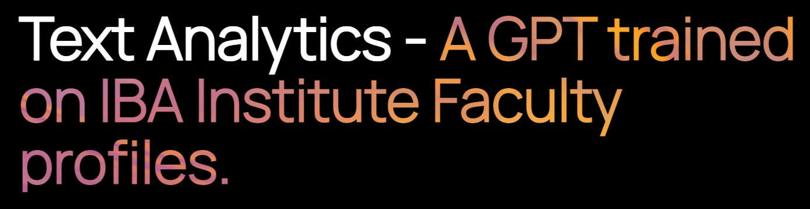
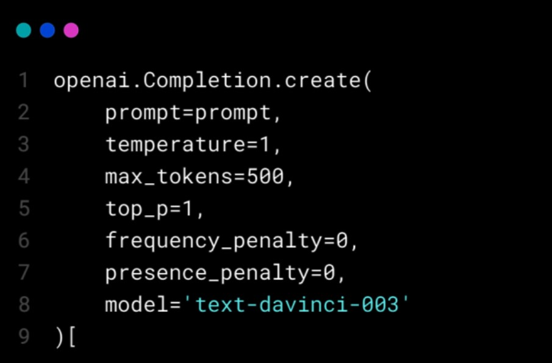
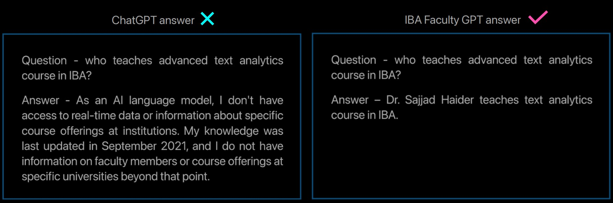
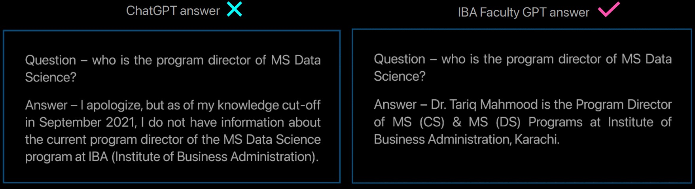
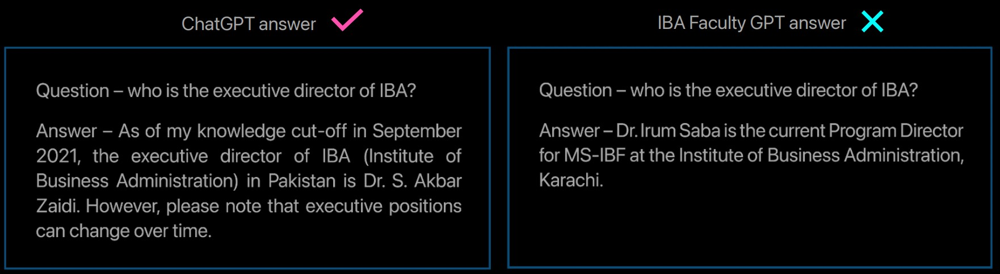

 **Problem Statement**

Universities  have  a  problem  with  how  they  currently  communicate  with students when they have questions. They mostly use email or phone calls, but these methods can be slow and not always provide quick answers. One solution to this problem is to introduce a chatbot. A chatbot for universities can help with different things like registering for courses and giving general information. 

 **Overview**

In this project, I created a chatbot for IBA that has information about its faculty members. I collected the data by scraping websites using a Python library called Beautiful Soup. To give accurate answers, I used the OpenAI ADA embedding model to analyze the scraped data and find the most relevant information for each question. Then, I used GPT APIs to generate responses based on the chosen text generation model. I mainly used the GPT-3.5 model called DaVinci for text generation. 

 **Project Workflow**

- Web scraping: Used Beautiful Soup to extract  faculty profile links from IBA website and stored them in a list. 
- Data collection: Gathered complete faculty information by visiting profile  links,  extracting  details  (name,  position,  department, specialization,  onboard  status,  email),  and  storing  them  in  data structures. 
- Data processing: Used pandas to organize and process collected data. Created a DataFrame for faculty information, handled missing values, and removed duplicates. 
- Data preprocessing: Transformed text format, structured data into sections (experience, qualifications, interests, courses, publications) for readability and user-friendliness. 
- Embedding calculation: Calculated embeddings for processed data using  OpenAI  ADA  model,  representing  text  numerically  and capturing semantic relationships. 
- Cost estimation: Estimated cost of embedding calculation based on word count, considering OpenAI API pricing. 
- Similarity  measurement:  Compared  user's  question  vector  with information  vectors  using  cosine  similarity  to  identify  relevant information. 
- Information retrieval: Sorted and retrieved most relevant information based on cosine similarity scores for accurate responses.
- GPT-3.5  interaction:  Utilized  Text-davinci  model  to  generate answers  by  providing  relevant  context  and  prompt,  obtaining response as output. 

 **Parameters for OpenAI API**

The 'parameter' in this context refers to the configuration settings used when making the API call to the OpenAI GPT-3.5 model. Let's take a closer look at the different parameters and their values used in the code: 

Temperature = 1 - With a temperature value of 1, the generated output from the model will be relatively diverse and creative. A higher temperature all ows for  more  randomness  in  the  generated  text,  leading  to  a  wider  range  of possible responses. 

max\_tokens = 500 - The max\_tokens parameter is set to 500, which means that the generated completion will be limited to a maximum of 500 tokens. This ensures that the response does not exceed a certain length.

top\_p = 1 - By setting top\_p to 1, the model considers the entire probability distribution when generating the completion. It means that the model takes into account all possible tokens and their respective probabilities during the text generation process. 

frequency\_penalty = 0 - A frequency penalty of 0 indicates that there is no specific penalty assigned to discourage the model from repeating similar phrases or responses. The model can freely generate output without any restrictions related to repetition. 

presence\_penalty = 0 - Similarly, a presence penalty of 0 suggests that the model is not penalized for including specific input phrases or words in the generated  completion.  It  allows  the  model  to  freely  incorporate  relevant phrases from the input context into the response. 

Model = text-davinci-003 - The model parameter specifies the model variant used for generating the completion. In this case, 'text-davinci-003' refers to the  OpenAI  GPT-3.5  model,  which  is  known  for  its  advanced  language generation capabilities. 

 **Performance Comparison**

After creating the project, the next step was to test its strength. I compared the answers provided by the original ChatGPT with those generated by my own self-created IBA Faculty GPT using an embedding technique. Here are some of the results: 

In the comprehensive evaluation consisting of 10 to 20 questions, the self - created IBA Faculty GPT demonstrated a correct response rate ranging from 75% to 65%. On the other hand, the original ChatGPT achieved a correct response rate ranging from 35% to 45% for the same set of questions. It is worth noting that these percentages are based on a subset of questions and may  not  represent  the  overall  performance  of  the  models  in  all  tested scenarios. 
